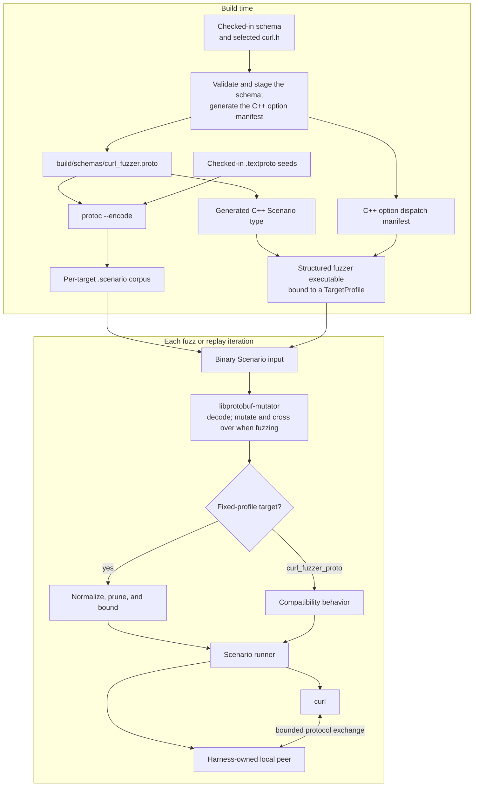

# Structured fuzzers

The structured fuzzer suite models a curl transfer as a protobuf `Scenario`.
[libprotobuf-mutator](https://github.com/google/libprotobuf-mutator) mutates the
message rather than an unstructured byte stream, then a target-specific policy
normalizes it before the harness runs curl against a bounded local peer.

The targets still consume binary files. The textproto files under
`scenarios/curl_fuzzer_proto/` are readable seed sources; CMake encodes them as
binary protobuf corpus entries under `build/generated_corpora/`.

## How an input reaches curl



The `CurlOptionId` values are checked in because they are part of the serialized
corpus format. During the build, the option-manifest generator
reads the active options between the schema's `CURL-OPTIONS` markers, checks
their values against the selected curl checkout's `curl.h`, stages the schema
under `build/schemas/`, and generates the C++ dispatch manifest. The remaining
message types describe request data, peer responses, and focused API-lifecycle
work.

Each thin entrypoint binds the shared runtime to one `TargetProfile`. Fixed
profiles select a protocol, remove fields and options that their peer cannot
use, and cap repeated fields and byte budgets. This prevents mutations from
spending most of an iteration on inert or unbounded data. The original
`curl_fuzzer_proto` target is the exception: it preserves its historical mixed
semantics and corpus without registering a profile postprocessor.

The peers are owned by the harness. Stream protocols generally use local
socket pairs; TFTP and HTTP/3 use private loopback UDP endpoints. Baseline curl
configuration disables ambient proxies, restricts protocols, redirects direct
connections to the harness, and uses short timeouts. A new target or option
must preserve those isolation guarantees.

## Build and replay a scenario

Build one structured target and its generated seed corpus:

```shell
./mainline.sh -t curl_fuzzer_proto_http
```

Replay one seed with the standalone runner:

```shell
./build/curl_fuzzer_proto_http \
  build/generated_corpora/curl_fuzzer_proto_http/basic_get.scenario
```

The standalone executable accepts files and directories, so an entire
target-specific seed set can be replayed too:

```shell
./build/curl_fuzzer_proto_http \
  build/generated_corpora/curl_fuzzer_proto_http/
```

Set `FUZZ_VERBOSE=1` when a reproduction needs curl's protocol trace. These
locally built executables replay inputs; OSS-Fuzz builds provide the active
libFuzzer mutation engine.

Continue with [Writing and inspecting scenarios](scenarios.md), then consult
[Target profiles](target-profiles.md) before choosing a corpus or adding a
field.
